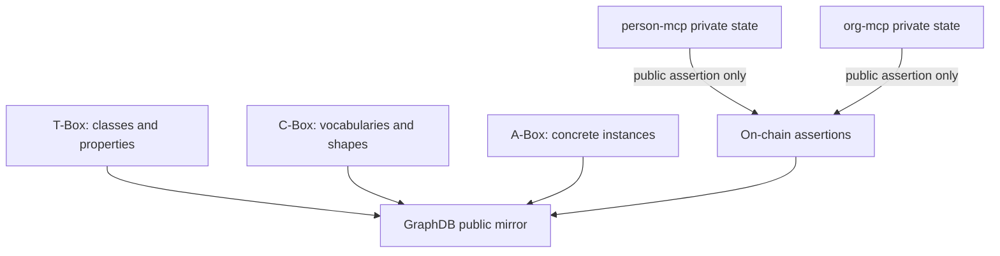

# Ontology Documentation

This folder explains the Smart Agent ontology in human terms. The Turtle
source of truth remains `docs/ontology/`; these documents explain the
concepts, diagrams, and example A-Box data that make the ontology easier to
use.

## Reading Order

| # | Document | Purpose |
| --- | --- | --- |
| 1 | [01-layering-and-source-of-truth.md](01-layering-and-source-of-truth.md) | T-Box, C-Box, A-Box, GraphDB named graphs, and source-of-truth rules |
| 2 | [02-agents-identities-and-profiles.md](02-agents-identities-and-profiles.md) | Agent, identity, smart account, profile, and owner routing |
| 3 | [03-relationships-roles-and-assertions.md](03-relationships-roles-and-assertions.md) | Directed relationship edges, roles, assertions, and validation |
| 4 | [04-intents-work-items-and-activities.md](04-intents-work-items-and-activities.md) | Intent, need, offering, work item, activity, outcome, and work mode |
| 5 | [05-graphdb-public-projection.md](05-graphdb-public-projection.md) | How public facts reach GraphDB and what never appears there |
| 6 | [06-common-private-mcp-ontology.md](06-common-private-mcp-ontology.md) | Common ontology for local MCP data across person, org, issuer, and verifier stores |
| 7 | [07-mcp-sql-table-mapping.md](07-mcp-sql-table-mapping.md) | Table-by-table mapping from MCP/web SQL rows to ontology classes |
| 8 | [08-anoncreds-sql-ontology-mapping.md](08-anoncreds-sql-ontology-mapping.md) | How AnonCreds wallet data, SQL metadata, proofs, and public assertions align |
| 9 | [09-specialized-mcp-source-mapping.md](09-specialized-mcp-source-mapping.md) | Skills, geo, family, verifier, and other specialized MCP source mappings |
| 10 | [10-domain-tbox-diagram-index.md](10-domain-tbox-diagram-index.md) | Domain-oriented ontology diagram index and notation |
| 11 | [11-identity-access-domain-ontology.md](11-identity-access-domain-ontology.md) | Agent identity, accounts, passkey sessions, and access control |
| 12 | [12-private-mcp-data-domain-ontology.md](12-private-mcp-data-domain-ontology.md) | Private owner-routed MCP data classes and relationships |
| 13 | [13-credentials-proof-domain-ontology.md](13-credentials-proof-domain-ontology.md) | AnonCreds, issuer state, proof requests, and verifier receipts |
| 14 | [14-relationships-trust-domain-ontology.md](14-relationships-trust-domain-ontology.md) | Relationship edges, assertions, validation, feedback, and trust |
| 15 | [15-skills-domain-ontology.md](15-skills-domain-ontology.md) | Skill definitions, skill claims, skill credentials, and discovery fit |
| 16 | [16-geo-domain-ontology.md](16-geo-domain-ontology.md) | Geo features, geo claims, H3 proofs, and location credentials |
| 17 | [17-intent-marketplace-work-domain-ontology.md](17-intent-marketplace-work-domain-ontology.md) | Intents, needs, offerings, matches, entitlements, and work items |

## Source Files

| Layer | Location | Meaning |
| --- | --- | --- |
| T-Box | `docs/ontology/tbox/*.ttl` | Domain-neutral classes and properties |
| C-Box | `docs/ontology/cbox/*.ttl` | Controlled vocabularies, enumerations, SHACL shapes |
| A-Box | `docs/ontology/abox/*.ttl` and GraphDB runtime data | Concrete instances |

## One-Sentence Model

Smart Agent uses on-chain assertions as the public trust spine, MCPs as the
private owner-routed data stores, and GraphDB as a read-only knowledge base
mirroring only public on-chain facts.

