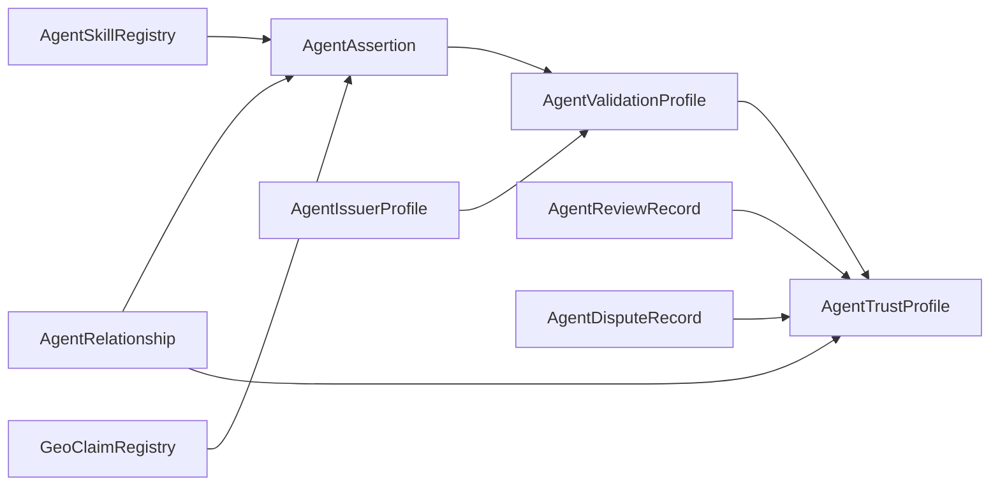

# Validation And Feedback Capabilities - Implementation Plan

> **Status**: design
> **Pattern**: build a first-class validation and feedback graph on top of
> the existing `AgentAssertion`, `AgentValidationProfile`,
> `AgentReviewRecord`, `AgentDisputeRecord`, `AgentIssuerProfile`, and
> `AgentTrustProfile` contracts.
> **Goal**: make discovery and trust scoring explainable: every score should
> answer "what was claimed, who asserted it, who validated it, what evidence
> backs it, and what negative feedback exists?"

## 1. Why This Layer Exists

Relationships, skills, and geo claims describe what may be true about an
agent:

| Domain | Example |
| --- | --- |
| Relationship | `alice.agent` is a member of `grace-church.agent` |
| Skill | `alice.agent` practices grant writing |
| Geo | `alice.agent` has a public claim near `erie.colorado.geo` |

The validation and feedback layer describes why another agent should trust
those statements:

| Layer | Question answered |
| --- | --- |
| Assertion | Who said the claim is true? |
| Validation | Who independently checked it, and how? |
| Feedback | What happened when the agent was used? |
| Dispute | What negative evidence exists? |
| Trust profile | How should those signals be weighted for this context? |

This follows the Agentic Trust idea of an inspectable trust graph:

```text
Validator -> validates -> Assertion -> supports -> Claim/Situation
Reviewer  -> reviews   -> Agent/Interaction
Disputer  -> flags     -> Agent/Claim/Review
TrustProfile -> weighs -> validations + reviews + disputes + domain claims
```

## 2. Existing Primitives

### 2.1 `AgentAssertion`

Current role:

- records a speech act by an asserter;
- currently points at `AgentRelationship.edgeId`;
- supports `SELF_ASSERTED`, `OBJECT_ASSERTED`, `MUTUAL_CONFIRMATION`,
  `VALIDATOR_ASSERTED`, `ORG_ASSERTED`, and `APP_ASSERTED`;
- includes validity window, revocation, and `evidenceURI`.

Gap:

- it is relationship-edge-specific;
- skills and geo have `assertionId` hooks, but `AgentAssertion` cannot
  natively assert about a `SkillClaim` or `GeoClaim`.

### 2.2 `AgentValidationProfile`

Current role:

- records that a validator validated an agent and optionally an assertion;
- stores validation method, verifier contract, TEE metadata,
  `evidenceURI`, `validatedBy`, and timestamp.

Gap:

- no revocation or expiry;
- no evidence commitment;
- no confidence score;
- no direct subject type;
- no explicit validator authorization check against `AgentIssuerProfile`;
- not yet synced into the knowledge base for discovery.

### 2.3 `AgentReviewRecord`

Current role:

- records reviewer feedback about an agent;
- supports review types, recommendation types, dimension scores,
  evidence URI, feedback hash, revocation, and responses.

Gap:

- no interaction or task identifier;
- endpoint/tool fields exist in the struct but are not populated by
  `createReview`;
- no delegation-gated review flow is fully enforced on chain;
- not yet a first-class GraphDB ranking signal.

### 2.4 `AgentDisputeRecord`

Current role:

- records negative trust evidence: flags, disputes, sanctions,
  suspensions, revocations, and blacklists.

Gap:

- disputes are agent-level only;
- they cannot yet target a specific assertion, validation, review,
  skill claim, or geo claim;
- not yet consistently applied as a scoring penalty.

### 2.5 `AgentIssuerProfile`

Current role:

- registers issuers/validators with issuer type, supported validation
  methods, and claim types.

Gap:

- current validation recording does not require the validator to be active;
- `claimTypes` should be broadened to cover subject classes such as
  relationship, skill, geo, runtime, endpoint, delegation, and review.

## 3. Requirements

### 3.1 Functional Requirements

1. A validation can target a relationship edge, skill claim, geo claim,
   credential presentation, runtime/deployment, endpoint, delegation, or
   standalone agent profile.
2. A validation can reference an assertion when the validation is about
   "who said this is true."
3. A validation can reference direct evidence when no assertion exists yet.
4. A review can be linked to a specific interaction, endpoint, skill, task,
   or delegation.
5. A dispute can target an agent or a specific trust artifact.
6. Discovery can filter and rank agents by validation method, validator
   type, review dimensions, negative evidence, and domain-specific claims.
7. Every public trust artifact is synced to GraphDB with source block,
   contract address, event id, and evidence commitment.
8. Private AnonCred-backed signals remain local to `person-mcp`; only
   score contributions or zero-knowledge verifier receipts are published
   when explicitly requested.

### 3.2 Non-Functional Requirements

1. The public graph must be explainable; every score contribution should
   be inspectable.
2. The contracts should keep compact on-chain records and place large
   evidence bundles off chain behind content hashes.
3. Discovery queries must never read private named graphs by default.
4. Validation and feedback records need revocation, expiry, and stale-data
   handling.
5. Review spam and self-review must be prevented or heavily discounted.
6. Scoring must be policy-driven, not hardcoded to one universal trust
   score.

## 4. Core Design

### 4.1 Common Trust Artifact Model

Every trust artifact should have a canonical graph identity:

```text
artifactType:
  relationshipEdge
  skillClaim
  geoClaim
  credentialPresentation
  runtimeDeployment
  serviceEndpoint
  delegationGrant
  review
  dispute
  agentProfile

artifactId:
  edgeId | claimId | presentationId | runtimeId | endpointId |
  grantHash | reviewId | disputeId | agentAddress
```

On chain this can be represented with:

```solidity
struct ArtifactRef {
    bytes32 artifactType;
    bytes32 artifactId;
}
```

Use well-known constants in `AgentPredicates` / SDK predicates:

```text
TRUST_ARTIFACT_RELATIONSHIP_EDGE
TRUST_ARTIFACT_SKILL_CLAIM
TRUST_ARTIFACT_GEO_CLAIM
TRUST_ARTIFACT_CREDENTIAL_PRESENTATION
TRUST_ARTIFACT_RUNTIME_DEPLOYMENT
TRUST_ARTIFACT_SERVICE_ENDPOINT
TRUST_ARTIFACT_DELEGATION_GRANT
TRUST_ARTIFACT_REVIEW
TRUST_ARTIFACT_AGENT_PROFILE
```

### 4.2 Generalized Assertions

Evolve `AgentAssertion` from relationship-only to artifact-based:

```solidity
struct AssertionRecord {
    uint256 assertionId;
    bytes32 subjectType;
    bytes32 subjectId;
    AssertionType assertionType;
    address subjectAgent;
    address asserter;
    uint64 validFrom;
    uint64 validUntil;
    bool revoked;
    bytes32 evidenceCommit;
    string evidenceURI;
}
```

Compatibility path:

- keep `makeAssertion(edgeId, ...)` as a wrapper for relationship edges;
- add `makeArtifactAssertion(input)` for all new domains;
- preserve `getAssertionsByEdge(edgeId)` by indexing
  `subjectType == relationshipEdge`.

This lets existing relationship resolution keep working while allowing
skills and geo to use the same assertion layer.

### 4.3 Validation Records

Upgrade `AgentValidationProfile` to validate an artifact or assertion:

```solidity
struct ValidationRecord {
    uint256 validationId;
    address agent;
    uint256 assertionId;       // 0 if standalone
    bytes32 subjectType;       // optional direct artifact target
    bytes32 subjectId;
    bytes32 validationMethod;
    address verifierContract;
    address validatedBy;
    uint16 confidenceScore;    // 0..10000
    uint64 validAfter;
    uint64 validUntil;
    bool revoked;
    bytes32 evidenceCommit;
    string evidenceURI;
    uint64 validatedAt;
}
```

Validation methods should include the current `AgentIssuerProfile`
constants plus domain-specific methods:

| Method | Meaning |
| --- | --- |
| `self-asserted` | No independent verification; useful as a baseline only |
| `counterparty-confirmed` | The counterparty confirms the claim |
| `mutually-confirmed` | Both sides confirm |
| `validator-verified` | Registered validator reviewed the evidence |
| `zk-verified` | A zero-knowledge verifier checked the claim |
| `oracle-attested` | External oracle attested the fact |
| `tee-onchain-verified` | Runtime measurement verified on chain |
| `reproducible-build` | Build artifact matches source/release metadata |
| `insurer-issued` | Insurance/coverage exists |
| `governance-approved` | Governance body approved the claim |

### 4.4 Feedback Records

`AgentReviewRecord` should become the feedback graph source for agent
performance:

```text
Review
  reviewer -> subject agent
  optional interactionId / taskId / endpointId / skillId
  reviewType
  recommendation
  dimensions
  evidenceCommit
  evidenceURI
  response thread
```

Recommended additions:

```solidity
struct ReviewTarget {
    bytes32 targetType;   // agent, endpoint, skillClaim, delegationGrant, task
    bytes32 targetId;
}
```

Populate these from the app and A2A flows:

- after an agent-to-agent interaction;
- after a service endpoint call;
- after a credential verification;
- after a delegated action completes;
- after human review of an organization/service agent.

### 4.5 Disputes And Negative Evidence

Disputes should target the same artifact model:

```text
Dispute target:
  agent
  assertion
  validation
  review
  skillClaim
  geoClaim
  relationshipEdge
  endpoint
  delegationGrant
```

Discovery and trust scoring should treat unresolved disputes as strong
negative evidence, especially for runtime, safety, compliance, and
certification-related queries.

## 5. Architecture

### 5.1 On-Chain Layer



Responsibilities:

- contracts store compact records and emit events;
- large evidence stays off chain behind `evidenceURI` and
  `evidenceCommit`;
- SDK clients normalize constants and artifact references.

### 5.2 Knowledge Base Layer

GraphDB should maintain named graphs:

| Named graph | Contents | Visibility |
| --- | --- | --- |
| `data/onchain` | public relationships, skill claims, geo claims, assertions, validations, reviews, disputes | discovery APIs |
| `data/private` | private commitments and caller-owned private metadata | `person-mcp` only |
| `data/provenance` | block numbers, tx hashes, log indexes, source contract, sync timestamps | internal/explain UI |
| `vocab/trust` | T-Box, SHACL shapes, validation methods, review dimensions | public |

Required RDF classes:

```text
sa:TrustArtifact
sa:Assertion
sa:ValidationRecord
sa:ReviewRecord
sa:ReviewDimensionScore
sa:DisputeRecord
sa:IssuerProfile
sa:TrustPolicy
sa:EvidenceBundle
sa:RuntimeDeployment
sa:ServiceEndpoint
```

Required RDF properties:

```text
sa:assertsArtifact
sa:assertedBy
sa:validatedArtifact
sa:validatedAssertion
sa:validatedBy
sa:validationMethod
sa:confidenceScore
sa:evidenceCommit
sa:evidenceURI
sa:reviewedAgent
sa:reviewedArtifact
sa:reviewDimension
sa:recommendation
sa:disputeTarget
sa:trustPolicy
sa:sourceBlock
sa:sourceTx
```

### 5.3 Discovery And Scoring Layer

Discovery should compute context-specific explanations:

```text
DiscoveryTrust(agent, queryContext):
  relationship score
  skill score
  geo score
  validation score
  review score
  dispute penalty
  runtime score
  private credential overlap score
```

Example scoring policy:

| Signal | Suggested treatment |
| --- | --- |
| Self-asserted claim | low positive |
| Counterparty-confirmed relationship | medium positive |
| Org-issued skill/geo validation | medium/high positive |
| Registered validator verification | high positive |
| ZK/on-chain/TEE verification | high positive, domain-dependent |
| Recent positive reviews | positive with recency decay |
| Open dispute | strong negative |
| Upheld sanction/blacklist | exclude or near-zero |
| Revoked assertion/validation | ignored or negative if abuse-related |

Scoring must return an explanation object, not only a number:

```ts
type TrustExplanation = {
  agent: `0x${string}`
  score: number
  policyId: string
  signals: Array<{
    kind: 'relationship' | 'skill' | 'geo' | 'validation' | 'review' | 'dispute' | 'runtime'
    artifactId: string
    contribution: number
    issuer?: `0x${string}`
    validator?: `0x${string}`
    evidenceCommit?: `0x${string}`
  }>
}
```

## 6. Capability Requirements

### 6.1 Validation Capability

Users/agents must be able to:

- view validations attached to an agent;
- view validations attached to a skill claim, geo claim, or relationship;
- verify whether the validator is active in `AgentIssuerProfile`;
- see validation method and confidence;
- see whether validation is current, expired, revoked, or disputed;
- drill into evidence metadata without exposing private credential values.

### 6.2 Feedback Capability

Users/agents must be able to:

- leave feedback after a real interaction;
- attach feedback to an agent, endpoint, skill, task, or delegation;
- score dimensions such as accuracy, reliability, responsiveness,
  compliance, safety, transparency, and helpfulness;
- append a subject response;
- revoke feedback they authored;
- distinguish verified interaction feedback from generic profile reviews.

### 6.3 Discovery Capability

Discovery must support queries such as:

```text
Find grant-writing agents certified by a trusted organization.
Find service agents with no open safety disputes.
Find agents near Erie with geo claims validated by an oracle.
Find agents with TEE-verified runtime and reliability score above 80.
Show why this agent ranked above another agent.
```

## 7. Implementation Strategy

### V0 - Graph Sync And Read Model

Use current contracts as-is.

Deliverables:

- add `trust.ttl` ontology for assertions, validations, reviews,
  disputes, issuer profiles, evidence, and policies;
- sync existing contract events into GraphDB;
- expose read APIs:
  - `validationsForAgent(agent)`;
  - `validationsForAssertion(assertionId)`;
  - `reviewsForAgent(agent)`;
  - `disputesForAgent(agent)`;
  - `trustExplanation(agent, policyId)`;
- update discovery scoring to include validations, reviews, and disputes;
- show provenance in the UI.

Rationale:

- proves the value of the validation/feedback graph without immediate
  Solidity churn.

### V1 - Generic Artifact Assertions

Upgrade assertion targeting.

Deliverables:

- add `subjectType` and `subjectId` support to `AgentAssertion`;
- keep relationship-edge compatibility wrappers;
- update `GeoClaimRegistry` and `AgentSkillRegistry` flows to require or
  strongly prefer linked assertions for public high-trust claims;
- add SDK helpers:
  - `makeRelationshipAssertion`;
  - `makeSkillClaimAssertion`;
  - `makeGeoClaimAssertion`;
  - `makeRuntimeAssertion`;
- add SHACL constraints requiring `assertionRef` for certified/high-score
  public claims.

### V2 - Validation Lifecycle And Authorization

Strengthen `AgentValidationProfile`.

Deliverables:

- add `subjectType`, `subjectId`, `confidenceScore`, `validAfter`,
  `validUntil`, `revoked`, and `evidenceCommit`;
- require active validator profile for non-self validation methods;
- index validations by artifact, assertion, validator, and agent;
- add validator revocation / bulk invalidation epoch;
- add dispute targeting for validations.

### V3 - Interaction-Bound Feedback

Connect feedback to actual usage.

Deliverables:

- define `InteractionReceipt` / `TaskReceipt` shape;
- require reviews above a configurable trust weight to reference a receipt
  or delegated interaction;
- populate endpoint/tool/skill target fields;
- add A2A flow for requesting and submitting feedback;
- add review anti-spam controls:
  - no self-review;
  - one active review per reviewer/subject/interaction;
  - optional delegation proof from subject or interaction receipt.

### V4 - Policy-Driven Trust Profiles

Move scoring out of hardcoded contract logic and into named policies.

Deliverables:

- define `TrustPolicy` records in GraphDB;
- assign policy IDs such as:
  - `smart-agent.discovery.v1`;
  - `smart-agent.execution.v1`;
  - `smart-agent.runtime.v1`;
  - `smart-agent.minor-safety.v1`;
  - `smart-agent.skill-certification.v1`;
- make `AgentTrustProfile` either a simple on-chain baseline or a pointer
  to off-chain policy evaluation with auditable explanations;
- add policy-specific score explanations in discovery results.

### V5 - Economic Accountability

Optional, later-stage parity with Agentic Trust validator-pool ideas.

Deliverables:

- validator staking profiles;
- stake-weighted validations;
- slashing/dispute outcomes;
- validator leaderboards;
- insurance/coverage records;
- vertical validator pools for domains such as nonprofit, church,
  healthcare, legal, education, or geospatial.

## 8. Security And Privacy

### 8.1 Security Risks

| Risk | Mitigation |
| --- | --- |
| Fake validator validates claims | require active `AgentIssuerProfile` for trusted methods |
| Stale validations inflate score | add expiry, revocation, and recency decay |
| Review spam | require interaction receipts for high-weight reviews |
| Self-dealing review rings | discount dense reciprocal clusters and low-trust reviewers |
| Evidence URI mutates | require `evidenceCommit` |
| Private credential leakage | keep private claims in `person-mcp`; publish only receipts or score components |
| Validator compromise | support revocation epochs and disputes against validators |

### 8.2 Privacy Rules

- Public GraphDB queries only read `data/onchain`.
- Private AnonCreds never leave `person-mcp`.
- Review comments may be URI-only and encrypted when sensitive.
- Evidence bundles should support redaction and commitment-based
  verification.
- ZK verifier receipts may be public, but the underlying private attribute
  values should remain hidden.

## 9. Open Questions

1. Should `AgentAssertion` be upgraded in place or replaced with
   `AgentAssertionV2`?
2. Should validations be required for `certifiedIn` skill claims, or is
   cross-issued minting enough for the first release?
3. Which review types require an interaction receipt?
4. Should disputes target every artifact type in V1, or only agents,
   validations, and reviews?
5. Should trust policies be stored fully in RDF, JSON policy documents, or
   both with a shared content hash?

## 10. Recommended First Cut

The best first implementation is V0 plus the smallest part of V1:

1. Add `trust.ttl` and SHACL shapes.
2. Sync existing `AgentAssertion`, `AgentValidationProfile`,
   `AgentReviewRecord`, `AgentDisputeRecord`, and `AgentIssuerProfile`
   events into GraphDB.
3. Extend trust search to include validation/review/dispute signals.
4. Add a trust explanation object to discovery results.
5. Plan the `AgentAssertion` generic subject upgrade after the read model
   proves useful.

This gets the validation and feedback graph into discovery without blocking
on a contract migration, while still pointing toward the cleaner artifact
model needed for skills, geo, runtime, endpoints, and delegation.
