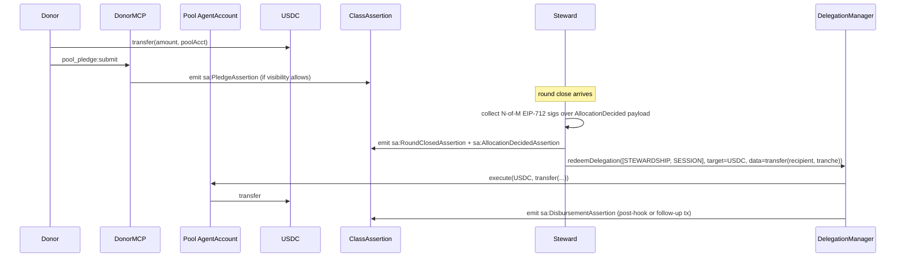

# On-Chain Treasury Plan — Intent Marketplace

> Implementation plan for moving the **public** parts of the three intent-marketplace lanes (Pool / Round / MatchInitiation; Proposal touched only at decision/award time) onto chain using a **DAO Treasury** governance pattern.

---

## 1. Architecture summary

**Goal.** Promote each public lane state-change of the Pool / Round / MatchInitiation surface (and the decision/award moment of the Proposal lane) from "MCP row + opportunistic anchor" to "on-chain assertion is the public source of truth, with the pool's `AgentAccount` operating as a programmable DAO treasury that disburses under capability-stack delegation."

**Pivot.** The current architecture is *mostly there* on the read side: `ClassAssertion.sol` already exists, the four emit-helpers (`poolPledgeAssertion.ts`, `poolPledgedTotalAssertion.ts`, `roundAssertion.ts`, `matchInitiationAssertion.ts`) already exist, the GraphDB sync already accepts class assertions as the projection source (`apps/web/src/lib/ontology/graphdb-sync.ts`), and `Pool subClassOf OrganizationAgent` is already in T-Box. The missing pieces are (a) wiring those emits into the moments they should fire, (b) the *write* side — a real treasury that holds value and disburses under steward delegation — and (c) the new caveat enforcers that turn a generic `AgentAccount` into a programmable, mandate-restricted, quorum-gated DAO treasury.

**Opinionated choice on quorum.** Off-chain N-of-M EIP-712 signature aggregation, redeemed by the lead steward through a `QuorumEnforcer`. **Not** Governor-style on-chain voting. Reasons: (i) the steward set is small (2–7 typical, per `pools.stewards`) so off-chain signing is operationally cheap; (ii) gas cost of a Governor vote per disbursement would dwarf the disbursement on small pools (prayer-minutes, $50 mutual-aid pledges); (iii) the existing `DelegationManager` already provides EIP-712 + caveat-stack semantics, so adding one more enforcer is far less surface than introducing a Governor + Timelock; (iv) we *keep the option* to later swap the inner signature step for a Snapshot/Tally-style off-chain vote of pledgers where appropriate, without changing the on-chain contract surface.

**Opinionated choice on treasury asset.** Single-stablecoin v1 (USDC on the deployment chain), wrapped commitments for non-monetary units via a separate `CommitmentRegistry`. ETH-native treasury (donor sends ETH) is *not* supported in v1 — pool mandates are denominated in fiat-equivalent and matching to ETH price introduces an oracle dependency the current architecture deliberately avoids.

**What we mirror from prior art** (full comparison in `output/dao-pool-round-best-practices.md`):

- **Allo Protocol v2 (`register / allocate / distribute`)** — our `RoundOpened → AllocationDecided → Disbursement` lifecycle is the same shape with renamed verbs; we collapse Allo's separated Pool + Strategy contracts into a single `Pool` agent with policy carried by caveats.
- **Aragon OSx conditional permissions** — Aragon arrived at the same `(who, where, permissionId, condition)` primitive we have as caveat enforcers. We diverge by using a *nested-authority* delegation chain (root → STEWARDSHIP → SESSION) where Aragon stays flat — better for off-chain composition + per-round sub-keys.
- **Hats Protocol eligibility modules** — instead of re-minting `STEWARDSHIP_DELEGATION` on every steward rotation, we consult a `StewardEligibilityRegistry` at *redemption time*. Adding/removing a steward is a single registry write, not a delegation roll. See § 4.3.
- **oSnap / UMA optimistic execution** — our `AllocationDecided → Disbursement` is gated by a 72h dispute window (TimestampEnforcer lower-bound). An award is presumed valid unless `sa:GrantRescindedAssertion` or `sa:AllocationRevokedAssertion` lands inside the window.
- **OZ Governor cancellation guardian** — pool root key (or designated lead steward) can revoke the SESSION_DELEGATION between AllocationDecided and Disbursement. Single-trusted-role pattern.

### 1.1 ASCII architecture

```
                                        ┌───────────────────────────────────────────────┐
                                        │                  Pool Agent                   │
                                        │              (ERC-4337 AgentAccount)          │
                                        │   addr = AgentAccountFactory.getAddress(salt) │
                                        │   owners = pool root key (steward set bag)    │
                                        │   holds: USDC balance OR commitment-only      │
                                        └────────────┬──────────────────────────────────┘
                                                     │ ROOT_AUTHORITY
                                                     ▼
                                         STEWARDSHIP_DELEGATION (long-lived)
                                         delegator: pool agent
                                         delegate:  steward-set wrapper (a 1-of-1
                                                    proxy whose isValidSignature
                                                    requires N-of-M steward sigs;
                                                    or ROUND_LEAD steward EOA when
                                                    quorum is encoded as a caveat
                                                    arg — see § 4)
                                         caveats:
                                           • PoolMandateEnforcer (acceptedKinds, geoRoot)
                                           • AllowedTargetsEnforcer (USDC token + own treasury)
                                           • TimestampEnforcer (steward-set rotation cliff)
                                                     │
                                                     ▼
                                         SESSION_DELEGATION (per round / per disbursement)
                                         delegator: steward-set wrapper
                                         delegate:  the lead steward's session signer
                                                    (or the AwardOrchestrator contract
                                                    address — see § 3)
                                         caveats:
                                           • RoundDecisionWindowEnforcer (roundId, decisionDate)
                                           • AllocationLimitEnforcer (proposalIRI, trancheCap)
                                           • QuorumEnforcer (N-of-M sig set, salt)
                                           • ValueEnforcer (max USDC per call)
                                                     │
                                                     ▼
                                         redeemDelegation(target=USDC, calldata=transfer(recipient, amount))
                                                     │
                                                     ▼
                                         executes via pool.AgentAccount.execute(...)
                                                     │
                                                     ▼
                                         MultiSend.multiSend(packed [(call, USDC, 0, transfer(recipient, amount)),
                                                                     (call, ClassAssertion, 0, emit(sa:Disbursement, ...))])
                                                     │   (delegatecall — atomic in one userOp)
                                                     │
                                                     ├──→ USDC.transfer(recipient, amount)
                                                     │
                                                     └──→ ClassAssertion.emitClassAssertion(
                                                            sa:DisbursementAssertion, ...)

   Public read path:
     anvil event ──→ KNOWN_ASSERTION_CLASSES handler (graphdb-sync.ts)
                      ──→ Turtle triples ──→ GraphDB named graph ──→ SPARQL ──→ UI

   Private body path (unchanged):
     org-mcp.db / person-mcp.db (bodies for proposals, anonymous pledges,
     non-public match initiations) + cross-delegations for steward read.
```

### 1.2 Mermaid (treasury lifecycle)



---

## 2. Per-lane on-chain surface

For each public state-change moment we list: **trigger**, **assertion that fires**, **contract call (if any) that enforces the rule**, **payload shape**.

### 2.1 Pool lane

| # | Trigger | Assertion | Contract call | Payload (top-level keys) |
|---|---|---|---|---|
| P1 | Pool agent created | `sa:PoolOpenedAssertion` (NEW) | `AgentAccountFactory.createAccount(rootKey, salt)` + `AgentAccountResolver.setProperty(name/desc/agent-type/mandate)` + `ClassAssertion.emit(sa:PoolOpenedAssertion)` | `{ poolAgentId, treasuryAddress, governanceModel, acceptedUnits, acceptedKinds, ceilingPolicy, capacityCeiling?, stewards[], openedAt }` |
| P2 | Pool mandate edit (acceptedKinds change) | `sa:PoolMandateUpdatedAssertion` (NEW) | `ClassAssertion.emit` + steward userOp | `{ poolAgentId, prevMandateHash, newMandate, updatedAt }` |
| P3 | Donor pledges (`pool_pledge:submit`) — public attrib. | `sa:PledgeAssertion` (existing) | `emitPledgeAssertion()` (already wired in `apps/web/src/lib/actions/poolPledges.action.ts`) — **+ NEW**: USDC-denominated pledges trigger `USDC.transfer` to the pool's `AgentAccount` address (real custody) | `{ id, pledgerAgentId, poolAgentId, cadence, unit, amount, duration?, storyPermissions, poolVisibility, pledgedAt }` |
| P4 | Donor pledges (`storyPermissions=anonymous` OR private pool) | **no class assertion**; contributes only to aggregate | `CommitmentRegistry.commit()` for non-monetary; for monetary, donor wraps via a stealth deposit channel (out of scope v1 — see § 8 risks) | n/a |
| P5 | Pool aggregate snapshot | `sa:PoolPledgedTotalAssertion` (existing helper) | `emitPledgedTotalAssertion()` — **+ NEW**: fire on every pledge submit / amend / stop, *or* on a debounce; the aggregate is mandatory for anonymous-pledge tier visibility | `{ poolAgentId, pledgedTotal, allocatedTotal, availableTotal, emittedAt }` |
| P6 | Steward set rotation | `sa:StewardSetUpdatedAssertion` (NEW) | Pool root key signs new `STEWARDSHIP_DELEGATION` + `DelegationManager.revokeDelegation(prevHash)` + `ClassAssertion.emit` | `{ poolAgentId, prevStewards, newStewards, quorum, rotatedAt }` |
| P7 | Pool closed / wound down | `sa:PoolClosedAssertion` (NEW) | `ClassAssertion.emit` + return-of-funds disbursement chain | `{ poolAgentId, closedAt, finalDispositionTxs[] }` |

### 2.2 Round lane (Proposal-lane infra; the round itself is public, the proposals are private)

| # | Trigger | Assertion | Contract call | Payload |
|---|---|---|---|---|
| R1 | Steward opens a round | `sa:RoundOpenedAssertion` (existing helper) | `emitRoundOpenedAssertion()` — **needs a new MCP write tool** `round:open` in `apps/org-mcp/src/tools/rounds.ts` (currently read-only — see gap) | `{ id, fundAgentId, mandate, reportingCadence, deadline, decisionDate, requiredCredentials, visibility }` |
| R2 | `proposalsReceived` increments (proposal submit) | optional `sa:RoundCounterAssertion` (NEW, low-priority) | could be derived from `sa:GrantProposalSubmittedCoarseAssertion` count instead; recommend **no** dedicated counter assertion | n/a |
| R3 | Round deadline passes | `sa:RoundDeadlinePassedAssertion` (NEW, optional) | a tx anyone can poke that calls `ClassAssertion.emit` if `block.timestamp > deadline` | `{ roundId, observedAt }` |
| R4 | Stewards finalize allocations (decision) | `sa:RoundClosedAssertion` (existing helper) **+** `sa:AllocationDecidedAssertion` (NEW) | `emitRoundClosedAssertion()` then `ClassAssertion.emit(sa:AllocationDecidedAssertion)` carrying the awarded list (proposal IRIs + tranche schedule) | `{ roundId, awards: [{proposalIRI, recipientAddr, totalAmount, tranches: [{trancheId, amount, milestoneRef, releaseConditions}]}], decidedAt, quorumProof }` |
| R4a | **Dispute window opens** (oSnap-style) | `sa:DisputeWindowOpenedAssertion` (NEW) | Emitted alongside R4 with `disputeUntil = decidedAt + 72h`. The SESSION_DELEGATION's `TimestampEnforcer` lower-bound = `disputeUntil` so disbursement userOps revert until the window passes. | `{ roundId, decidedAt, disputeUntil, escalationContact }` |
| R4b | Award canceled before disbursement | `sa:RoundCanceledAssertion` (NEW) **or** `sa:AllocationRevokedAssertion` (NEW, per-proposal) | Pool root key (or designated lead) calls `DelegationManager.revokeDelegation(SESSION_HASH)` and emits the cancel/revoke assertion. OZ Governor cancellation-guardian pattern. | `{ roundId|proposalIRI, reasonURI, revokedAt }` |
| R5 | A specific tranche disbursed (only after R4a window passes and no R4b) | `sa:DisbursementAssertion` (NEW) | `DelegationManager.redeemDelegation` ⟶ pool.execute ⟶ USDC.transfer; assertion emitted in same userOp via a multi-call wrapper | `{ disbursementId, poolAgentId, recipientAddr, recipientAgentIRI, amount, unit, sourceProposalIRI, trancheId, txHash, disbursedAt }` |
| R6 | Tranche outcome attested | `sa:OutcomeAttestationAssertion` (NEW; v1 optional, v2 required) | validators call `ClassAssertion.emit` (their own `AgentAccount` is the asserter); payload feeds the matchmaker via a derived `sa:ProposerTrackRecord` GraphDB projection | `{ disbursementId, validatorIRIs[], outcomeKind: 'delivered'\|'partial'\|'not_delivered'\|'disputed', outcomeQuality: 1..5, attestedAt, evidenceURI }` |

### 2.3 MatchInitiation lane

| # | Trigger | Assertion | Contract call | Payload |
|---|---|---|---|---|
| M1 | `match_initiation:create` against two **public** intents | `sa:MatchInitiationAssertion` (existing helper) | `emitMatchInitiationAssertion()` — **already wired** in `apps/web/src/lib/actions/matchInitiations.action.ts:113`, **but** the MCP tool `match_initiation:create` (in both `apps/org-mcp/src/tools/matchInitiations.ts` and `apps/person-mcp/src/tools/matchInitiations.ts`) writes the row first; the action layer is what calls the helper. Confirm: action-layer is the right boundary (it can read public/public-coarse status of both intents from GraphDB). Recommendation: keep the boundary; gap is only that the on-chain emit must be the *gate* that decides whether to set `onChainAssertionId`. | `{ id, initiator, viewedIntent, candidateIntent, initiationKind, proposedAt, basis }` |
| M2 | Status change (`pending → consumed/superseded`) | `sa:MatchInitiationStatusUpdatedAssertion` (NEW) | small assertion; reuse `ClassAssertion.emit` | `{ id, prevStatus, newStatus, updatedAt }` |
| M3 | Match references a **private** intent | **no anchor** (cf. SHACL `sa:PrivateIntentInitiationNoAnchorShape`) | n/a | n/a |

### 2.4 Proposal lane (decision/award moment only)

Per IA § 2.3 / SHACL `sa:GrantProposalAlwaysPrivateShape`: **`sa:GrantProposal` itself never anchors** while submitted. The on-chain surface only fires at the *award* moment, and only as a coarse outcome assertion that references a proposal IRI by hash (the proposal body remains in proposer's MCP).

| # | Trigger | Assertion | Contract call | Payload |
|---|---|---|---|---|
| G1 | Proposal awarded by steward quorum | `sa:GrantAwardedAssertion` (NEW) | `ClassAssertion.emit` (asserter = pool agent) — **only** awarded outcome anchors, never the body | `{ proposalIRI, roundId, recipientAgentIRI, totalAwarded, unit, awardedAt, quorumProof }` |
| G2 | Award rescinded (cause: outcome failure, fraud) | `sa:GrantRescindedAssertion` (NEW) | `ClassAssertion.emit` + `AgentDisputeRecord.fileDispute` (existing contract) | `{ proposalIRI, reasonURI, rescindedAt }` |

---

## 3. New contracts & enforcers to build

All new artifacts live under `packages/contracts/src/`. Interfaces only.

### 3.1 New caveat enforcers

These slot into the existing `enforcers/` directory and follow `ICaveatEnforcer` (terms / args / beforeHook / afterHook). All revert on failure per existing convention.

#### `enforcers/PoolMandateEnforcer.sol`

Restricts disbursements to recipients whose target intent / proposal matches the pool's mandate — acceptedKinds, geoRoot.

```solidity
interface IPoolMandateEnforcer is ICaveatEnforcer {
    // terms:  abi.encode(bytes32 acceptedKindsRoot, bytes32 geoRoot, address mandateRegistry)
    //         (acceptedKindsRoot is a Merkle root over allowed sa:Kind C-Box IRIs)
    // args:   abi.encode(bytes32 proposalKind, bytes32 proposalGeo, bytes32[] kindProof, bytes32[] geoProof)
}
event MandateMatched(bytes32 indexed delegationHash, bytes32 proposalKind);
error KindNotAccepted();
error GeoNotAccepted();
```

Gas budget: ~25k for two Merkle proofs. Stored terms ~96 bytes.

#### `enforcers/RoundDecisionWindowEnforcer.sol`

Disbursement userOps allowed only after `decisionDate`, only on `proposalIRI`s on the awarded list of `roundId`.

```solidity
interface IRoundDecisionWindowEnforcer is ICaveatEnforcer {
    // terms: abi.encode(bytes32 roundId, uint256 decisionDate, bytes32 awardsRoot)
    //        (awardsRoot = Merkle root over (proposalIRIhash, recipient, totalAmount) tuples
    //         committed at AllocationDecided time)
    // args:  abi.encode(bytes32 proposalIRIHash, address recipient, uint256 totalAmount, bytes32[] proof)
}
error TooEarly();
error NotInAwardsList();
```

Gas: ~30k. The `awardsRoot` is committed in the `sa:AllocationDecidedAssertion` payload AND passed as terms when minting the SESSION_DELEGATION — that's how the enforcer ties chain-side to the off-chain award decision.

#### `enforcers/AllocationLimitEnforcer.sol`

Per-tranche cap; each disbursement decrements a stored counter so the same tranche cannot be paid twice.

```solidity
interface IAllocationLimitEnforcer is ICaveatEnforcer {
    // terms: abi.encode(bytes32 trancheId, uint256 capAmount, address asset)
    // args:  abi.encode(uint256 disburseAmount)
    // The enforcer maintains a mapping(bytes32 => uint256) trancheSpent;
    // afterHook increments it. beforeHook reverts if (trancheSpent[trancheId] + disburseAmount > capAmount).
}
event TrancheDrawn(bytes32 indexed trancheId, uint256 amount, uint256 remaining);
error TrancheCapExceeded();
```

Gas: ~30k (one SLOAD + SSTORE).

#### `enforcers/QuorumEnforcer.sol`

Verifies an N-of-M EIP-712 signature aggregation over a stable `AllocationDecided` payload. **Adopts Safe's `checkSignatures` packing verbatim** so steward signatures from `AgentAccount`-backed stewards (passkey / contract-sig via ERC-1271) and EOA stewards interoperate, and so Safe SDK tooling can sign for our pools.

```solidity
interface IQuorumEnforcer is ICaveatEnforcer {
    // terms: abi.encode(address[] signerSet, uint8 threshold, bytes32 payloadDomainSeparator)
    //
    // args:  abi.encode(bytes32 payloadHash, bytes signatures)
    //        where `signatures` is a packed blob, sorted-ascending by signer, of
    //        65-byte constant-slot entries per Safe's layout:
    //
    //          {32 r/data}{32 s/data}{1 v/type}
    //
    //        v-byte type discrimination (matches Safe Safe.sol):
    //          27 / 28  → ECDSA over `payloadHash`
    //          v > 30   → eth_sign (`\x19Ethereum Signed Message:...`)
    //          0        → ERC-1271 contract sig; r = signer addr (left-padded),
    //                     s = byte offset to (length-prefixed) dynamic sig bytes
    //                     in the calldata tail region
    //          1        → pre-approved hash; r = signer addr; signer must have
    //                     called ApprovedHashRegistry.approveHash(payloadHash)
    //                     before the redeem
    //          2        → secp256r1 (RIP-7212) for passkey stewards
    //
    // beforeHook (algorithm mirrors Safe's checkSignatures):
    //   require(signatures.length >= threshold * 65)
    //   for i in 0..threshold:
    //     read entry i; recover signer per v-byte type
    //     require(signer > prevSigner)            // sorted ascending — anti-duplicate
    //     require(signerSet contains signer)
    //   require(payloadHash binds the calldata being executed — i.e., the
    //           (roundId, awardsRoot, decisionDate, expiresAt, stewardSetHash)
    //           tuple in EIP-712 over PoolGovernance domain matches the
    //           ongoing redemption's roundId / awardsRoot)
}
error InsufficientQuorum();
error UnauthorizedSigner();
error DuplicateSigner();          // surfaced when sort-ascending check fails
error ApprovedHashRequired();     // v=1 path but no prior approveHash
error ContractSigInvalid();       // v=0 path, ERC-1271 returned non-magic
```

Gas: ~3k per signature + ~5k base for ECDSA paths. ERC-1271 paths add a contract call (~5–10k depending on the signer). For a 3-of-5 quorum on a small steward set, ~14k.

**Companion contract**: `ApprovedHashRegistry.sol` — a 1-storage-slot mapping `(signer, hash) → bool` written by `approveHash(bytes32)` and read by the v=1 path. Lets passkey-only stewards (their `AgentAccount` can't easily produce off-chain ECDSA over arbitrary EIP-712 payloads) pre-approve the `AllocationDecided` hash on chain instead of signing off-chain.

#### `enforcers/StewardEligibilityEnforcer.sol` (Hats-style runtime eligibility)

Replaces "re-mint STEWARDSHIP_DELEGATION on every steward rotation" with "consult an eligibility registry at sig-verification time." Borrowed from Hats Protocol's eligibility-module pattern — adding/removing a steward is a single registry write, not a delegation roll.

```solidity
interface IStewardEligibilityEnforcer is ICaveatEnforcer {
    // terms: abi.encode(address pool, address eligibilityRegistry)
    // args:  abi.encode(address[] orderedSigners)
    // beforeHook: for each signer, require(IStewardEligibilityRegistry(reg).isEligible(pool, signer))
}
error StewardNotEligible(address signer);
```

Pairs with `StewardEligibilityRegistry.sol` below.

#### `enforcers/CommitmentRedemptionEnforcer.sol` (non-monetary lane)

Allows a pool's stewards to redeem prayer-minutes / coaching-hours / hospitality-nights commitments by emitting an attestation on `CommitmentRegistry` (no token transfer).

```solidity
interface ICommitmentRedemptionEnforcer is ICaveatEnforcer {
    // terms: abi.encode(address commitmentRegistry, bytes32 unitClass)
    // args:  abi.encode(bytes32 commitmentId, uint256 unitsToRedeem)
}
```

### 3.2 New supporting contracts

#### `CommitmentRegistry.sol`

Where non-monetary pledges live. A pledge becomes a signed commitment; redemption is a steward-attested fulfillment.

```solidity
contract CommitmentRegistry {
    struct Commitment {
        bytes32 commitmentId;       // keccak(pledgeId)
        address committer;          // donor's AgentAccount
        address pool;               // pool's AgentAccount
        bytes32 unitClass;          // sa:Kind concept IRI hash (e.g., prayer-minute)
        uint256 totalUnits;         // committed quantity
        uint256 redeemedUnits;      // running tally
        uint256 expiresAt;          // 0 = no expiry
        bytes32 visibilityHash;     // hash of (storyPermissions, poolVisibility) — drives anchor decision
    }
    mapping(bytes32 => Commitment) public commitments;
    function commit(bytes32 commitmentId, address pool, bytes32 unitClass, uint256 totalUnits, uint256 expiresAt) external;
    function redeem(bytes32 commitmentId, uint256 units, bytes32 attestationURI) external; // gated by CommitmentRedemptionEnforcer
    function revoke(bytes32 commitmentId) external;
    event CommitmentMade(bytes32 indexed commitmentId, address committer, address pool, bytes32 unitClass, uint256 totalUnits);
    event CommitmentRedeemed(bytes32 indexed commitmentId, uint256 units, address by, bytes32 attestationURI);
    event CommitmentRevoked(bytes32 indexed commitmentId);
}
```

Note: a *public-tier* commitment also fires `sa:PledgeAssertion` (the existing helper, with `unit ≠ USDC`). The CommitmentRegistry is the *settlement* side; the assertion is the *publication* side. They are independent.

#### `AwardOrchestrator.sol` (optional v1; consider v2)

A small contract the lead steward calls to atomically (a) emit `sa:RoundClosedAssertion` + `sa:AllocationDecidedAssertion`, (b) commit the awardsRoot, (c) deploy a new SESSION_DELEGATION that is bounded by the awardsRoot. This reduces the chance of a steward "publishing the awards but forgetting to mint the session delegation" race. **Decision: defer to phase 3** — the off-chain orchestration script in `apps/web/src/lib/actions/` is enough for v1.

#### `StewardEligibilityRegistry.sol`

Per-pool current steward set + eligibility flags. The pool's stewards (or root key) write; `StewardEligibilityEnforcer` reads at sig-verification time.

```solidity
contract StewardEligibilityRegistry {
    struct StewardSet {
        address[] stewards;
        uint8 threshold;
        mapping(address => bool) eligibility;
    }
    mapping(address => StewardSet) internal _sets;
    function isEligible(address pool, address steward) external view returns (bool);
    function setSteward(address pool, address steward, bool eligible) external; // gated to pool root or pool's stewardship
    function setThreshold(address pool, uint8 threshold) external;
    function getStewards(address pool) external view returns (address[] memory, uint8 threshold);
    event StewardEligibilityChanged(address indexed pool, address indexed steward, bool eligible);
    event ThresholdChanged(address indexed pool, uint8 threshold);
}
```

This is the Hats `IHatsEligibility` shape adapted to our pool model. Cascade is automatic: a removed steward's signature is rejected by `StewardEligibilityEnforcer` on the next redeem, without touching the STEWARDSHIP_DELEGATION.

#### `MandateRegistry.sol`

Per-pool mandate Merkle roots keyed by pool address. The `PoolMandateEnforcer` reads from this contract so updating a pool's mandate is a simple contract write rather than re-issuing the entire delegation chain.

```solidity
contract MandateRegistry {
    mapping(address => bytes32) public kindsRoot;
    mapping(address => bytes32) public geoRoot;
    function setMandate(address pool, bytes32 kindsRoot_, bytes32 geoRoot_) external; // onlyPool (msg.sender == pool)
    event MandateUpdated(address indexed pool, bytes32 kindsRoot, bytes32 geoRoot);
}
```

### 3.3 Account-level Guards (new pattern, additive to caveats)

Safe runs pre/post hooks via a Guard slot on every `execTransaction`. We adopt the same idea as a slot on `AgentAccount.execute` so org-wide rules ("no calls to a known-bad address list", "freeze on dispute filed", "delay all transfers > $10k by 24h") layer over the per-delegation caveats.

```solidity
interface IAccountGuard {
    /// Called immediately before AgentAccount routes a call to its target.
    /// Reverts to abort the call. Receives the same triple as execute().
    function checkBefore(address target, uint256 value, bytes calldata data) external;

    /// Called after the call returns. `success` carries the underlying call's
    /// outcome so a guard can tally usage even on revert.
    function checkAfter(address target, uint256 value, bytes calldata data, bool success) external;
}

contract GuardManager {
    function setGuard(address guard) external;          // gated to AgentAccount owners
    function guard() external view returns (address);
}
```

The guard slot is **optional** — if unset, `AgentAccount.execute` runs as today. **Critical: caveats remain authoritative for delegation-scoped policy; guards are for global, account-scoped policy.** A caveat protects the holder of *one* delegation; a guard protects the entire `AgentAccount`'s spend surface.

Use cases on day one:
- A `DenyListGuard` that reverts on transfers to addresses in a per-account block-list.
- A `DisputeFreezeGuard` that reverts on outgoing transfers when `AgentDisputeRecord` has an open dispute against the account.
- A `MaxDailyTransferGuard` that tracks daily outflow per token.

Adopt explicitly because Safe operators report the `Guard` slot as one of the most-used policy-layering mechanisms in production, and we currently have no equivalent. See `output/safe-architecture-comparison.md` § 3 Q7.

### 3.4 `MultiSend.sol` library (resolves Q11)

A delegatecall-only library that packs N calls into one transaction, mirroring Safe's `MultiSendCallOnly`. Resolves the open question of how to atomically `USDC.transfer(recipient, amount)` *and* `ClassAssertion.emit(sa:DisbursementAssertion)` in one userOp without changing `AgentAccount.execute`'s ABI.

```solidity
library MultiSend {
    /// Packed format: each entry is
    ///   {1-byte op}{20-byte target}{32-byte value}{32-byte dataLen}{dataLen bytes data}
    /// where op = 0 (call) or op = 1 (delegatecall — disabled in CallOnly variant).
    /// Iterates and either reverts on failure or bubbles success.
    /// MUST be invoked via delegatecall from the caller's AgentAccount.
    function multiSend(bytes memory transactions) internal;
}
```

Two variants — `MultiSend.sol` (allows delegatecall, riskier) and `MultiSendCallOnly.sol` (call-only, safer). **Default: `MultiSendCallOnly` for the treasury path.** Disbursements never need delegatecall; the call-only variant prevents an entire class of "delegatecall to malicious target hijacks the AgentAccount" exploits.

### 3.5 Class-assertion taxonomy additions

In T-Box (extend `docs/ontology/tbox/proposal.ttl` and `pool-pledge.ttl`):

- `sa:PoolOpenedAssertion` ✓ (added)
- `sa:PoolMandateUpdatedAssertion` ✓ (added)
- `sa:StewardSetUpdatedAssertion` ✓ (added — note: now mostly a *log* of registry writes, not an authority change)
- `sa:PoolClosedAssertion` ✓ (added)
- `sa:AllocationDecidedAssertion` ✓ (added)
- `sa:DisputeWindowOpenedAssertion` ✓ (added)
- `sa:RoundCanceledAssertion` ✓ (added)
- `sa:AllocationRevokedAssertion` ✓ (added)
- `sa:DisbursementAssertion` ✓ (added)
- `sa:DisbursementStreamCreatedAssertion` (deferred — Sablier opt-in for `RecurringRound`)
- `sa:DisbursementStreamCanceledAssertion` (deferred)
- `sa:OutcomeAttestationAssertion` ✓ (added; payload extended with `outcomeKind` + `outcomeQuality`)
- `sa:GrantAwardedAssertion` ✓ (added)
- `sa:GrantRescindedAssertion` ✓ (added)
- `sa:CommitmentMadeAssertion` (optional — `sa:PledgeAssertion` with `unit != USDC` may suffice)

These all reuse the existing `ClassAssertion` ABI. **No new event class on chain.** The class IRI lives in the assertion payload. Status checkmarks reflect what's already in T-Box at the time of writing this version.

---

## 4. Stewardship delegation chain

### 4.1 Three-tier delegation hashes

```
Tier 0  Pool agent's root key signs:
        DELEGATION_0 = {
          delegator: poolAgentAccount,
          delegate:  STEWARD_SET_PROXY,        // a deterministic 1-of-1 contract whose
                                                // isValidSignature(hash, sig) calls
                                                // QuorumEnforcer.verify and returns ERC-1271 magic.
          authority: ROOT_AUTHORITY,
          caveats: [
            { enforcer: AllowedTargetsEnforcer, terms: encode([USDC, CommitmentRegistry, ClassAssertion, MandateRegistry]) },
            { enforcer: AllowedMethodsEnforcer, terms: encode([USDC.transfer.selector, CommitmentRegistry.redeem.selector, ClassAssertion.emitClassAssertion.selector, MandateRegistry.setMandate.selector]) },
            { enforcer: PoolMandateEnforcer,   terms: encode([acceptedKindsRoot, geoRoot, MandateRegistry]) },
            { enforcer: TimestampEnforcer,     terms: encode([0, stewardSetRotationDeadline]) }
          ],
          salt: 0
        }
        Stored: STEWARDSHIP_DELEGATION_HASH on chain in DelegationManager registry.
        Lifetime: until steward set rotates → revoked.

Tier 1  STEWARD_SET_PROXY (acting as N-of-M signer) signs:
        DELEGATION_1 = {
          delegator: STEWARD_SET_PROXY,
          delegate:  ROUND_LEAD_STEWARD_SESSION,   // ephemeral session signer for one round
          authority: hashDelegation(DELEGATION_0),
          caveats: [
            { enforcer: RoundDecisionWindowEnforcer, terms: encode([roundId, decisionDate, awardsRoot]) },
            { enforcer: ValueEnforcer,               terms: encode([roundBudgetCeiling]) },
            { enforcer: TimestampEnforcer,           terms: encode([decisionDate, decisionDate + 90 days]) }
          ],
          salt: roundId
        }
        Stored: SESSION_DELEGATION_HASH per round.
        Lifetime: per round (~90 days post decision); revoked on round close.

Tier 2  ROUND_LEAD_STEWARD_SESSION signs at redemption time (no on-chain registration; redeemed inline):
        DELEGATION_2 = {
          delegator: ROUND_LEAD_STEWARD_SESSION,
          delegate:  ROUND_LEAD_STEWARD_SESSION,    // self-redeem; the lead just calls
                                                    // redeemDelegation([DELEGATION_0, DELEGATION_1])
                                                    // — DELEGATION_2 is conceptual, not minted
          authority: hashDelegation(DELEGATION_1),
          caveats: [
            { enforcer: AllocationLimitEnforcer, terms: encode([trancheId, trancheCap, USDC]) },
            { enforcer: QuorumEnforcer,          terms: encode([stewardAddrs[], threshold, payloadDomainSeparator]) }
          ]
        }
```

### 4.2 EIP-712 payload for `AllocationDecided` quorum signing

```typescript
{
  domain: { name: "PoolGovernance", version: "1", chainId, verifyingContract: poolAgentAccount },
  types: {
    AllocationDecided: [
      { name: "roundId",        type: "bytes32" },
      { name: "awardsRoot",     type: "bytes32" },
      { name: "decisionDate",   type: "uint256" },
      { name: "expiresAt",      type: "uint256" },
      { name: "stewardSetHash", type: "bytes32" }   // hashes signerSet+threshold to bind to current set
    ]
  },
  message: { roundId, awardsRoot, decisionDate, expiresAt, stewardSetHash }
}
```

Stewards sign this off-chain; lead bundles all sigs into the `args` of `QuorumEnforcer` at redemption time.

### 4.3 Steward-set rotation

**Hats-style — registry write, not delegation re-mint.** Per `output/dao-pool-round-best-practices.md` § 3 Q3, replace the previous "re-mint STEWARDSHIP on every change" pattern with an eligibility-registry update. The STEWARDSHIP_DELEGATION stays the same; only eligibility flips.

`pools.stewards` change → pool's root key (or current stewards under STEWARDSHIP):
1. Calls `StewardEligibilityRegistry.setSteward(pool, removed, false)` to flip the removed steward's eligibility off.
2. Calls `StewardEligibilityRegistry.setSteward(pool, added, true)` for any added steward.
3. Optionally `StewardEligibilityRegistry.setThreshold(pool, newThreshold)` if the quorum threshold changes.
4. Emits `sa:StewardSetUpdatedAssertion` carrying the diff (old/new stewards, threshold, transactedAt).

**No delegation revocation needed.** `StewardEligibilityEnforcer` reads `isEligible(pool, signer)` at sig-verification time. Removed stewards' future signatures are rejected automatically on the next redeem; in-flight `treasury_proposal` rows whose signer set is now invalid get `:assemble` failures pointing to the ineligible signer. The `treasury_proposal` table can prune itself by checking eligibility at `:list_pending` query time.

**When to also revoke a SESSION_DELEGATION**: only if the rotation is *adversarial* (a steward turned hostile and an in-flight session has their session signer as `delegate`). In that case the rotation runbook explicitly calls `DelegationManager.revokeDelegation(SESSION_HASH)` for the affected session. This is a security action, not a routine rotation.

**Why this is better than the Safe pattern.** Safe's owner rotation does NOT disable enabled modules — well-known footgun. Our previous "re-mint STEWARDSHIP" pattern fixed that but at the cost of expensive every-rotation churn. Hats-style eligibility registry gets the cleanup-on-rotate benefit without the churn — and *also* without leaving dangling modules. See `output/safe-architecture-comparison.md` § 3 Q6 and `output/dao-pool-round-best-practices.md` § 2.10.

---

## 5. MCP write-side changes

For each MCP tool, the new step is an explicit emit hook (or contract call) **after** the row write succeeds. We adopt the pattern already used by `apps/web/src/lib/actions/poolPledges.action.ts` (call the emit helper *from the action layer*, not from inside the MCP tool, because the action layer has the visibility-cascade context).

### 5.1 `apps/org-mcp/src/tools/pools.ts`

| Tool | Today | Change |
|---|---|---|
| (none — pool creation flows through `apps/web/src/lib/actions/pools.action.ts` today) | n/a | **New tool**: `pool:create` writes the row, calls `AgentAccountFactory.createAccount(rootKey, salt)`, calls `AgentAccountResolver.setProperty(name/desc/agent-type/ATL_LATITUDE/ATL_LONGITUDE)`, mints initial `STEWARDSHIP_DELEGATION` to the steward set, calls `MandateRegistry.setMandate`, then emits `sa:PoolOpenedAssertion`. |
| `pool:read` | reads pool body | unchanged |
| `pool:contribute_to_total` | increments aggregate counter | **Add**: after counter update, debounced call to `emitPledgedTotalAssertion()`. |
| **New** `pool:rotate_stewards` | n/a | takes new steward set + new quorum, generates new STEWARDSHIP_DELEGATION (signed by pool root key via the relay), calls `DelegationManager.revokeDelegation` on prior, emits `sa:StewardSetUpdatedAssertion`. |
| **New** `pool:update_mandate` | n/a | computes new Merkle roots over acceptedKinds / geoRoot, calls `MandateRegistry.setMandate`, emits `sa:PoolMandateUpdatedAssertion`. |

### 5.2 `apps/org-mcp/src/tools/poolPledges.ts` and `apps/person-mcp/src/tools/poolPledges.ts`

| Tool | Today | Change |
|---|---|---|
| `pool_pledge:submit` | writes row; action layer calls `emitPledgeAssertion` | **Add**: for USDC-denominated pledges, the action layer also constructs a userOp `USDC.transfer(poolAcct, amount)` and submits it through donor's `AgentAccount`. For non-monetary pledges, action layer calls `CommitmentRegistry.commit`. The class assertion fires unchanged. |
| `pool_pledge:amend` | mutates row | **Add**: emit `sa:PledgeAmendedAssertion` (NEW; uses `sa:PledgeAssertion` class with revision payload referencing prior assertion). |
| `pool_pledge:stop` | mutates row | **Add**: emit `sa:PledgeStoppedAssertion` (NEW). |
| `pool_pledge:auto_stop` | mutates row | same as stop. |
| `pool_pledge:read_self` | reads | unchanged. |

### 5.3 `apps/org-mcp/src/tools/rounds.ts`

Today this file is read-only (`get_round`, `round:increment_proposals_received`). Round opening is currently seed-only (`scripts/seed-test-round.ts`). **Gap:** there is no `round:open` write tool.

| Tool | Today | Change |
|---|---|---|
| **New** `round:open` | n/a | writes row; calls `emitRoundOpenedAssertion` (helper exists, uncalled). |
| **New** `round:close` | n/a | writes status; calls `emitRoundClosedAssertion` (helper exists, uncalled); emits `sa:AllocationDecidedAssertion`; mints SESSION_DELEGATION. |
| `round:increment_proposals_received` | mutates counter | optional: emit a coarse counter assertion or skip (recommendation: skip — derivable). |

### 5.4 `apps/{org,person}-mcp/src/tools/matchInitiations.ts`

| Tool | Today | Change |
|---|---|---|
| `match_initiation:create` | writes row; action layer calls `emitMatchInitiationAssertion` | **Confirm wiring** — the helper is called in `apps/web/src/lib/actions/matchInitiations.action.ts:113`. The MCP tool stores the assertion id back. **Add**: status-update assertion for `pending → consumed`. |

### 5.5 `apps/org-mcp/src/tools/grantProposals.ts`

| Tool | Today | Change |
|---|---|---|
| `grant_proposal:submit` | writes row, no anchor (correct per SHACL) | unchanged. |
| **New** `grant_proposal:award` | n/a | writes status; emits `sa:GrantAwardedAssertion`; triggers tranche disbursement loop. |
| **New** `grant_proposal:rescind` | n/a | writes status; emits `sa:GrantRescindedAssertion`; calls `AgentDisputeRecord.fileDispute` if appropriate. |

### 5.6 Treasury proposal pool tools in `apps/org-mcp/src/tools/treasuryProposals.ts` (new file)

The proposal pool is a thin coordination cache for "who has signed which `AllocationDecided` payload so far." It does **not** become a separate MCP service — see `output/safe-architecture-comparison.md` § 6 for the rationale (Safe Tx Service is a convenience indexer, not the primary signing source; chain remains canonical).

| Tool | Purpose |
|---|---|
| `treasury_proposal:create` | Stewards or lead steward post the EIP-712 `AllocationDecided` message hash + payload + steward set hash; returns `proposalId`. |
| `treasury_proposal:sign` | Append a steward signature; validated against the current STEWARDSHIP signer set (and against the v-byte type byte for type-correctness). |
| `treasury_proposal:list_pending` | List proposals awaiting more sigs for a given pool. |
| `treasury_proposal:assemble` | Pack the collected sigs into Safe's sorted-ascending 65-byte-constant-slot blob with EIP-1271 dynamic-tail, ready as `args` for `QuorumEnforcer.beforeHook`. Returns the calldata payload for the lead steward to bundle into the redeem userOp. |
| `treasury_proposal:mark_executed` | Flips status when the on-chain → GraphDB sync sees the matching `sa:DisbursementAssertion`. |

Schema additions to `apps/org-mcp/src/db/schema.ts`:
```ts
treasuryProposals: { id, poolPrincipal, payloadHash, payloadJson, stewardSetHash,
                     status: 'collecting' | 'ready' | 'executed' | 'expired',
                     expiresAt, createdAt, updatedAt }
treasuryProposalSigs: { proposalId, signer, sigBytes, sigType (0|1|2|27|28|>30),
                        submittedAt }
```

Auth: any holder of the pool's `STEWARDSHIP_DELEGATION` chain (steward set members signing through their own `AgentAccount`) can call `:create` / `:sign` / `:list_pending`. `:assemble` is callable by the lead steward of an `:create`d proposal once `treasuryProposalSigs` count ≥ threshold.

### 5.7 New actions in `apps/web/src/lib/actions/`

- `treasuryDisburse.action.ts` — orchestrates a single tranche disbursement: validates awards-list, picks tranche, calls `treasury_proposal:assemble` on `org-mcp` to fetch the packed sig blob, calls `DelegationManager.redeemDelegation`, then `MultiSendCallOnly.multiSend([USDC.transfer, ClassAssertion.emit])` so transfer + assertion are atomic in the same userOp.
- `roundClose.action.ts` — orchestrates allocation decision: steward UI surfaces proposals-on-round, lead steward submits awards JSON, action layer calls `treasury_proposal:create`, gathers signatures via UI calls to `treasury_proposal:sign`, emits `sa:RoundClosedAssertion` + `sa:AllocationDecidedAssertion`, mints the SESSION_DELEGATION.

---

## 6. GraphDB sync changes

`apps/web/src/lib/ontology/graphdb-sync.ts` already has a class-agnostic `KNOWN_ASSERTION_CLASSES` handler. The changes are:

1. **Add the new assertion classes** to `KNOWN_ASSERTION_CLASSES`: `sa:PoolOpenedAssertion`, `sa:PoolMandateUpdatedAssertion`, `sa:StewardSetUpdatedAssertion`, `sa:PoolClosedAssertion`, `sa:AllocationDecidedAssertion`, `sa:DisbursementAssertion`, `sa:OutcomeAttestationAssertion`, `sa:GrantAwardedAssertion`, `sa:GrantRescindedAssertion`, `sa:PledgeAmendedAssertion`, `sa:PledgeStoppedAssertion`, `sa:MatchInitiationStatusUpdatedAssertion`.

2. **Flip these projections from MCP-read to assertion-read**:
   - `emitPoolPledgedTotalsTurtle` (current MCP-read aggregator) → driven by `sa:PoolPledgedTotalAssertion` event chain. The aggregate computation moves on-chain (or to the emit-helper); GraphDB just mirrors.
   - `pool capacity` widget projection → from `sa:PoolPledgedTotalAssertion`.
   - `round status` projection (open / closed) → from `sa:RoundOpenedAssertion` + `sa:RoundClosedAssertion`.
   - `round allocations` widget → from `sa:AllocationDecidedAssertion` + `sa:DisbursementAssertion`.

3. **Keep dual-source for one transition release**:
   - `match_initiations` (private-tier rows): keep MCP-read for steward-side queries; GraphDB-mirror only for public-tier.
   - `proposal_submissions`: never reaches GraphDB; steward review surface remains MCP-read via cross-delegation.

4. **Forbidden under IA P4**: any new helper named `publishProjection`, `mirrorToGraphDb`, etc. The reviewer checklist (IA § 7) flags these.

5. **Verification query** (after migration):
```sparql
SELECT (COUNT(?p) AS ?count) WHERE {
  ?p a sa:PoolOpened ; sa:treasuryAddress ?addr .
  FILTER NOT EXISTS { ?a a sa:PoolOpenedAssertion ; sa:subjectIRI ?p }
}
# expect 0 — every public Pool in GraphDB must have a PoolOpenedAssertion
```

---

## 7. Phased rollout

### Phase 1 — Anchors only, no real money (3–4 weeks, S+M+M+L)

**Goal**: prove the architecture without USDC custody risk. Every public state change emits the right class assertion; treasury balance is simulated (a counter on `Pool.pledgedTotal`).

- Wire `round:open` / `round:close` MCP tools so existing helpers `emitRoundOpenedAssertion` / `emitRoundClosedAssertion` are called.
- Wire `pool:create` MCP tool that calls `AgentAccountFactory` + emits `sa:PoolOpenedAssertion`.
- Add the new assertion classes (`sa:PoolOpenedAssertion`, `sa:AllocationDecidedAssertion`, etc.) to `KNOWN_ASSERTION_CLASSES` in `graphdb-sync.ts`.
- Implement the `roundClose.action.ts` orchestration with **mock disbursements** (emit `sa:DisbursementAssertion` but no `USDC.transfer`).
- Add the `treasury_proposal:create / sign / list_pending / assemble / mark_executed` tools to `apps/org-mcp/src/tools/treasuryProposals.ts` so stewards can rehearse the sig-collection flow before any caveat enforcers are deployed (these are MCP-only; no on-chain change).
- Foundry tests: `RoundDecisionWindowEnforcer`, `AllocationLimitEnforcer`.
- Wipe + reseed (`scripts/fresh-start.sh`). User has stated no backwards-compat needed.
- Acceptance: every public pool / round / match-initiation in GraphDB has a corresponding `sa:*Assertion`; the IA P4 verification query returns zero violations.

### Phase 2 — Stewardship delegation chain + quorum (3 weeks, L)

**Goal**: stewards can sign N-of-M and a session delegation gates a (still-mock) disbursement.

- Implement `QuorumEnforcer.sol` (Safe-format packed sigs per § 3.1) + `ApprovedHashRegistry.sol` + `STEWARD_SET_PROXY` ERC-1271 wrapper.
- Implement `RoundDecisionWindowEnforcer.sol`, `AllocationLimitEnforcer.sol`, `PoolMandateEnforcer.sol`, `MandateRegistry.sol`.
- Implement `MultiSendCallOnly.sol` (per § 3.4) so the disburse + assert composite is atomic.
- Implement `IAccountGuard` slot on `AgentAccount` (per § 3.3) — additive, optional; ship at least a `DisputeFreezeGuard` reference impl.
- Wire `pool:rotate_stewards`, `pool:update_mandate` MCP tools.
- Lift `treasury_proposal:assemble` to produce Safe-format packed sigs verifiable by `QuorumEnforcer`.
- E2E test: steward set signs an `AllocationDecided` → SESSION_DELEGATION minted → mock disbursement userOp validates through the full caveat stack.

### Phase 2.5 — Dispute window + cancellation guardian (1.5 weeks, M)

**Goal**: ship the adversarial-path defenses *before* real money enters the system. Phase 3's regression cost is high; Phase 2.5's regression cost is zero.

- Wire `sa:DisputeWindowOpenedAssertion` emit alongside `sa:AllocationDecidedAssertion` in `roundClose.action.ts`.
- Add `TimestampEnforcer` lower-bound (`disputeUntil = decidedAt + 72h`) to the SESSION_DELEGATION caveat stack.
- Implement `round:cancel` MCP tool (gated to pool root key) → revokes SESSION_DELEGATION → emits `sa:RoundCanceledAssertion`.
- Implement `grant_proposal:revoke_award` MCP tool (gated to pool root + lead steward) → emits `sa:AllocationRevokedAssertion`.
- E2E test: open round → propose → close round with award → file dispute within window → cancel → assert no disbursement possible.
- E2E test (adversarial): try to disburse before `disputeUntil` elapses — must revert at `TimestampEnforcer`.

### Phase 3 — Real USDC custody + non-monetary commitments (3 weeks, L)

**Goal**: pools hold real value; disbursements move real funds.

- Pool `AgentAccount` actually receives USDC. Donor pledge action layer constructs a `USDC.transfer` userOp through donor's `AgentAccount`.
- Implement `CommitmentRegistry.sol` + `CommitmentRedemptionEnforcer.sol`.
- Tranche disbursement: `treasuryDisburse.action.ts` calls `DelegationManager.redeemDelegation([STEWARDSHIP, SESSION], target=USDC, data=transfer(recipient, amount))`.
- E2E happy-path test: open round → submit proposal → close round with award → disburse tranche 1 → verify pool balance and recipient balance.
- Foundry tests: full delegation chain redemption, including caveat revert paths (`KindNotAccepted`, `TooEarly`, `TrancheCapExceeded`, `InsufficientQuorum`).

### Phase 4 — Outcomes, rescission, and disputes (2 weeks, M)

**Goal**: validators attest outcomes; bad outcomes can rescind awards.

- `OutcomeAttestationAssertion` emit path; validator-set delegation pattern (similar to stewards but on a different caveat stack).
- `grant_proposal:rescind` + `sa:GrantRescindedAssertion`.
- Wire `AgentDisputeRecord.fileDispute` to the rescind path.
- Tests: outcome attestation, dispute filing, rescission gating.

---

## 8. Risks & open questions

| ID | Question | Recommendation | Why it needs clarification |
|---|---|---|---|
| Q1 | Stablecoin choice — USDC mainnet, USDC L2 (Base / Arbitrum), or DAI? | USDC on Base (L2) for v1. Low gas; Circle's redeem path; stable. | Affects bridge / multi-chain treasury question (Q2) and gas budget. |
| Q2 | Multi-chain treasury? | No in v1. One pool = one chain. Cross-chain handled by future bridge contract. | Cross-chain delegation is a research problem; out of scope. |
| Q3 | How does the donor *actually* fund the pool? Wallet UX. | Donor's `AgentAccount` constructs a userOp `USDC.transfer(poolAcct, amount)`; signed by donor's session signer; bundler relays. The pledge submission action layer composes it. | Requires the existing ERC-4337 bundler infra to be production-ready. |
| Q4 | Anonymous-pledge custody. The donor's signer address is publicly linked. How do we accept anonymous USDC pledges? | **v1: don't.** Anonymous tier requires a tumbler / Privacy Pool contract; out of scope. Anonymous pledges remain *commitment-only* (CommitmentRegistry, no token transfer) for v1. Document this restriction in spec 002 follow-up. | Anonymity vs. on-chain custody is a known unsolved problem at this layer. |
| Q5 | Quorum mechanism — off-chain N-of-M (proposed) vs. Governor-style on-chain voting? | Off-chain N-of-M (justified in § 1). | Decided here; flag for review. |
| Q6 | Oracle for non-monetary unit equivalence (e.g., "1 prayer-minute = ? USDC")? | No oracle. CommitmentRegistry tracks units in their native dimension. Equivalence is a UI presentation concern, not a settlement concern. | Avoids oracle dependency; non-monetary pools never settle in fiat. |
| Q7 | Backfill vs. wipe? | Wipe (`fresh-start.sh`). User has confirmed no backwards-compat. | Backfill of existing seeded `match_initiations.on_chain_assertion_id` is non-trivial; reset is faster. |
| Q8 | Should `sa:PoolPledgedTotalAssertion` fire on every pledge, or be debounced? | Debounce to once per minute or once per N pledges. | Gas cost vs. UI freshness; 1-minute lag is acceptable for a capacity widget. |
| Q9 | Where does the `awardsRoot` live for proposal IRI hashes that proposers want to keep private? | The Merkle root reveals only that a proposal IRI was on the awards list, not the proposal body. The body stays in proposer's MCP. | This needs explicit privacy review — confirm with security agent. |
| Q10 | Steward EOA key management — passkey, EOA, social-recovery? | Stewards use `AgentAccount` with passkey (existing pattern in the contracts). Their EOA / passkey signs the EIP-712 `AllocationDecided` payload. | Avoids introducing a new key type. |
| Q11 | What is the asserter address for `sa:DisbursementAssertion`? | **Resolved**: pool's `AgentAccount` calls `MultiSendCallOnly.multiSend([USDC.transfer, ClassAssertion.emit])` via delegatecall — atomic in one userOp. See § 3.4. | n/a — closed. |
| Q12 | Does `AgentAccountResolver` already store `agent-type=Pool`? | Confirmed: `ATL_CONTROLLER` and other ATL_ properties exist; need to verify `agent-type` predicate is one of them or add it. | Quick check during phase 1. |
| Q13 | Should `QuorumEnforcer` accept `approveHash` pre-approvals (Safe `v=1`) alongside ECDSA + ERC-1271? | **Yes** — passkey-only stewards (whose `AgentAccount` can't easily produce off-chain ECDSA over arbitrary EIP-712 payloads) need the pre-approve escape hatch. Adopt Safe's `v=1` semantics verbatim with a companion `ApprovedHashRegistry`. See § 3.1 and `output/safe-architecture-comparison.md` § 3 Q7. | Decided here; flag for security agent review. |
| Q14 | Treasury proposal pool — separate `treasury-mcp` service or fold into `org-mcp`? | **Resolved**: fold into `org-mcp` per `output/safe-architecture-comparison.md` § 6. New file `apps/org-mcp/src/tools/treasuryProposals.ts`; two new tables in `org-mcp.db`. Reconsider for v2 if a multi-org pool surfaces. | n/a — closed. |
| Q15 | Should `AgentAccount` expose pre/post hooks (Safe Guard pattern) for org-wide policies? | **Yes** — add `IAccountGuard` slot per § 3.3. Defense-in-depth that lets us ship deny-lists, dispute-freezes, daily-cap rules without polluting per-delegation caveats. | Adds non-trivial review surface; needs security sign-off on the hook semantics (revert vs. silent skip). |
| Q16 | Sablier streaming for monthly-cadence pledges + tranche disbursements? | **Defer to v2.** Discrete tranches stay default; expose stream-as-disbursement as one optional `RecurringRound` strategy when proven necessary. Avoids a Sablier dep in v1. | `output/dao-pool-round-best-practices.md` § 3 Q5. |
| Q17 | Multi-asset pools (USDC + ETH + tokens + non-monetary in one pool)? | **Defer to v2.** v1 ships single-asset-per-pool; multi-asset modeled as sub-pool-per-asset (each its own `AgentAccount`) coordinated by a parent agent. Avoids oracle dep for cross-asset comparison. | `output/dao-pool-round-best-practices.md` § 3 Q7. |
| Q18 | Hats Protocol hat-tree integration for hierarchical pools? | **Defer to v2.** v1 uses our existing `NAMESPACE_CONTAINS` agent-naming tree for hierarchy (display + organization). Hats integration becomes compelling once eligibility-module pattern (Q3 above, now adopted) is battle-tested. | `output/dao-pool-round-best-practices.md` § 3 Q8. |
| Q19 | Round duration default + steward-fatigue cap? | **4 weeks per round** (2w open + 1w review + 1w dispute window). **1 round per pool per month** as a SHACL invariant — `sa:Pool` may have at most one `sa:Round` in `RoundOpen | RoundReview` state at a time. | RetroPGF 2025 pivot signal that round fatigue is real. |
| Q20 | Reputation feedback loop into the matchmaker? | **Yes — derive `sa:ProposerTrackRecord` from `sa:OutcomeAttestationAssertion`.** The matchmaker's existing `0.6 * 1/(1+hops) + 0.4 * (fulfilled+1)/(fulfilled+abandoned+2)` formula already takes `fulfilled / abandoned`; populate those counts from outcome attestations. Closes the BDI loop. | Phase 4 work; depends on outcome assertions being emitted in production. |

---

## 9. Tasks / effort sketch (S/M/L/XL)

### Contracts (`packages/contracts/src/`)

- [S] `MandateRegistry.sol` — minimal contract, mappings only.
- [M] `enforcers/PoolMandateEnforcer.sol` — Merkle-proof verification + `MandateRegistry` read.
- [M] `enforcers/RoundDecisionWindowEnforcer.sol` — timestamp + Merkle proof.
- [M] `enforcers/AllocationLimitEnforcer.sol` — stateful; tranche-spent counter.
- [L] `enforcers/QuorumEnforcer.sol` — N-of-M EIP-712 sig recovery; carefully audited (highest fraud-bait surface).
- [M] `enforcers/CommitmentRedemptionEnforcer.sol` — gates `CommitmentRegistry.redeem`.
- [M] `CommitmentRegistry.sol` — non-monetary settlement.
- [M] (deferred to Phase 3) `AwardOrchestrator.sol` — atomic round close + session-mint.
- [M] STEWARD_SET_PROXY (an ERC-1271-compatible 1-of-1 contract whose `isValidSignature` calls `QuorumEnforcer`'s verification logic; could be implemented as a thin AgentAccount or a new `MultiSigSigner.sol`).
- [L] Foundry tests for the full suite — happy path + revert paths (`KindNotAccepted`, `TooEarly`, `TrancheCapExceeded`, `InsufficientQuorum`, replay, expired session).

### MCP layer (`apps/{org,person}-mcp/src/tools/`)

- [M] `pool:create` — new tool; calls factory + resolver + emits `sa:PoolOpenedAssertion`.
- [M] `pool:rotate_stewards` — new tool; signs new STEWARDSHIP_DELEGATION + revokes prior.
- [S] `pool:update_mandate` — new tool; calls `MandateRegistry.setMandate` + emits `sa:PoolMandateUpdatedAssertion`.
- [S] `round:open` — new tool; calls existing `emitRoundOpenedAssertion`.
- [M] `round:close` — new tool; emits `sa:RoundClosedAssertion` + `sa:AllocationDecidedAssertion` + mints SESSION_DELEGATION.
- [S] `grant_proposal:award` — new tool; emits `sa:GrantAwardedAssertion`.
- [S] `grant_proposal:rescind` — new tool; emits `sa:GrantRescindedAssertion`.
- [S] Pledge `:amend` / `:stop` emit hooks.
- [S] Pledge submit USDC transfer integration (Phase 3).

### Web layer (`apps/web/src/lib/`)

- [L] `actions/treasuryDisburse.action.ts` — full disbursement orchestration (gather sigs, redeem delegation, emit assertion).
- [M] `actions/roundClose.action.ts` — round close orchestration.
- [M] `actions/poolCreate.action.ts` — pool creation orchestration.
- [M] Steward-sig-coordinator UI (or CLI) for collecting N-of-M signatures.
- [S] `lib/onchain/disbursementAssertion.ts` — new emit helper.
- [S] `lib/onchain/allocationDecidedAssertion.ts` — new emit helper.
- [S] `lib/onchain/poolOpenedAssertion.ts` — new emit helper.
- [M] `lib/ontology/graphdb-sync.ts` — extend `KNOWN_ASSERTION_CLASSES`.

### Ontology

- [S] Extend `docs/ontology/tbox/proposal.ttl` with the new assertion classes.
- [S] Extend `docs/ontology/tbox/pool-pledge.ttl` with the new assertion classes.
- [S] Add SHACL shapes for the disbursement / award invariants.
- [S] `scripts/sync-ontology.ts` run.

### Tests

- [L] Foundry suite for the four new enforcers (revert-paths matter most).
- [L] E2E `tests/onchain-treasury.e2e.ts` — open round → propose → close → award → disburse → outcome.
- [M] Privacy regression: no `sa:GrantProposal` IRI ever appears in a public `ClassAssertion` payload (SHACL run + grep).
- [S] Migration test: fresh-start.sh wipes and re-seeds successfully end-to-end.

### Migration

- [S] Update `WIPE_PATHS` in `scripts/fresh-start.sh` if any new persisted artefacts (probably not).
- [S] Update `scripts/seed-test-pool.ts` / `seed-test-round.ts` / `seed-test-pledge.ts` to call the new emit-on-open / emit-on-close paths so seed runs through the same code path as production.

---

## 10. Sequencing & dependencies

- Phase 1 depends on **nothing new on-chain** — all helpers exist, only wiring missing. Lowest-risk slice.
- Phase 2 requires the new enforcer contracts; depends on Phase 1's MCP tools so the round-close path has somewhere to mint the SESSION_DELEGATION.
- Phase 3 depends on Phase 2 (delegation chain) + new ERC-4337 paymaster setup for USDC if gas is to be sponsored.
- Phase 4 depends on Phase 3.

The sequencing keeps the "anchors only" architecture provable end-to-end before any real money risk enters. A regression in Phase 1 is recoverable by re-running `fresh-start.sh`; a regression in Phase 3 with USDC custody is not.

---

## 11. Critical Files for Implementation

Existing baseline:
- `packages/contracts/src/DelegationManager.sol` (delegation chain semantics — every new enforcer plugs into this)
- `packages/contracts/src/AgentAccount.sol` (the pool's treasury contract; its `execute` boundary is the disbursement gate; needs `IAccountGuard` slot per § 3.3)
- `apps/web/src/lib/onchain/poolPledgeAssertion.ts` (canonical emit-helper pattern; new helpers mirror it)
- `apps/web/src/lib/ontology/graphdb-sync.ts` (`KNOWN_ASSERTION_CLASSES` is where every new assertion class is registered for the public-read projection)
- `apps/org-mcp/src/tools/rounds.ts` (today read-only; the Phase-1 gap is here — needs `round:open` / `round:close` write tools wiring the existing emit helpers)

New files to create:
- `packages/contracts/src/MultiSendCallOnly.sol` — atomic disburse + assert library (resolves Q11)
- `packages/contracts/src/MultiSend.sol` — full variant; not used by treasury path but shipped for completeness
- `packages/contracts/src/IAccountGuard.sol` — pre/post hook interface for `AgentAccount`
- `packages/contracts/src/ApprovedHashRegistry.sol` — companion to `QuorumEnforcer` v=1 path
- `packages/contracts/src/enforcers/PoolMandateEnforcer.sol`
- `packages/contracts/src/enforcers/RoundDecisionWindowEnforcer.sol`
- `packages/contracts/src/enforcers/AllocationLimitEnforcer.sol`
- `packages/contracts/src/enforcers/QuorumEnforcer.sol` (Safe sig-format adopted verbatim)
- `packages/contracts/src/enforcers/CommitmentRedemptionEnforcer.sol`
- `packages/contracts/src/enforcers/StewardEligibilityEnforcer.sol` — Hats-style runtime eligibility check
- `packages/contracts/src/CommitmentRegistry.sol`
- `packages/contracts/src/MandateRegistry.sol`
- `packages/contracts/src/StewardEligibilityRegistry.sol` — replaces "re-mint STEWARDSHIP on rotation" with a registry write
- `packages/types/src/round.ts` — explicit Round-phase enum + transition table per `output/dao-pool-round-best-practices.md` § 4
- `apps/org-mcp/src/tools/treasuryProposals.ts` — proposal-pool coordination tools (per § 5.6; not a new MCP service)
- `apps/web/src/lib/onchain/poolOpenedAssertion.ts`
- `apps/web/src/lib/onchain/allocationDecidedAssertion.ts`
- `apps/web/src/lib/onchain/disbursementAssertion.ts`
- `apps/web/src/lib/onchain/grantAwardedAssertion.ts`
- `apps/web/src/lib/actions/treasuryDisburse.action.ts`
- `apps/web/src/lib/actions/roundClose.action.ts`
- `apps/web/src/lib/actions/poolCreate.action.ts`
